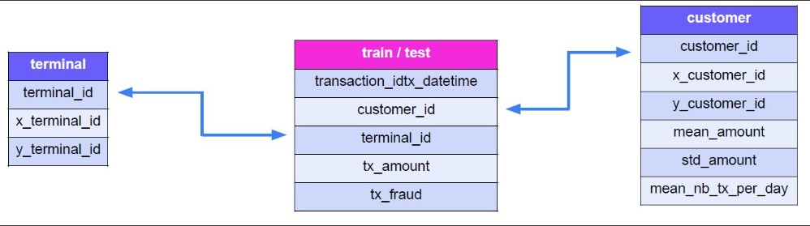

# Entendimento do Negócio

Com o aumento das transações eletrônicas em pontos de venda físicos, o uso de cartões de crédito tornou-se essencial no cotidiano. No entanto, essa facilidade também trouxe um aumento nas fraudes, incluindo transações fraudulentas em terminais físicos comprometidos e ataques direcionados a esses locais.

Fraudes em terminais físicos prejudicam financeiramente as instituições e afetam a confiança dos consumidores, além de impactar negativamente a reputação das empresas envolvidas. Por isso, a PoDShield enfrenta uma demanda crescente por soluções automatizadas que possam examinar rapidamente grandes volumes de transações e identificar padrões de fraude em terminais físicos.

**Objetivo:**

Desenvolver um modelo de machine learning para detecção de fraudes em cartões de crédito, focado exclusivamente em transações realizadas em terminais físicos.

---------------------------------------------------------------

# Entendimento dos Dados

Temos 4 tabelas que serão utilizadas como base de dados, sendo elas:

- Terminal

- Train

- Test

- Customer

Essas tabelas se relacionam da seguinte maneira:

----------------------------------------------------------------

# Análise Exploratória dos Dados

Essas são algumas das informações que foram extraídas das bases:

- As bases não possuem valores nulos

- A base de treino tem 291231 transações

- A base de teste tem 226731 transações

- Temos um total de 998 clientes diferentes

- Temos um total de 1994 terminais diferentes

- A taxa de fraude média é de 2,26%

- Temos 5 meses de histórico na base treino

- O mês com a maior taxa de fraude apresentou um valor de 2,42% 

- O mês com a menor taxa de fraude apresentou um valor de 2,07%

- Existe um terminal onde a taxa de fraude é de 41,49% e foram realizadas 94 transações

- O terminal com mais transações fez 495 transações e apresentou apenas 0,81% de taxa de fraude

- Cerca de 75,15% dos clientes já esteve envolvido em uma transação fraudulenta

Além disso, também foi verificada a distribuição dos clientes e dos terminais em um mapa global (Essa distribuição pode ser conferida no primeiro notebook do caso).

---------------------------------------------------------------------

# Preparação dos dados

